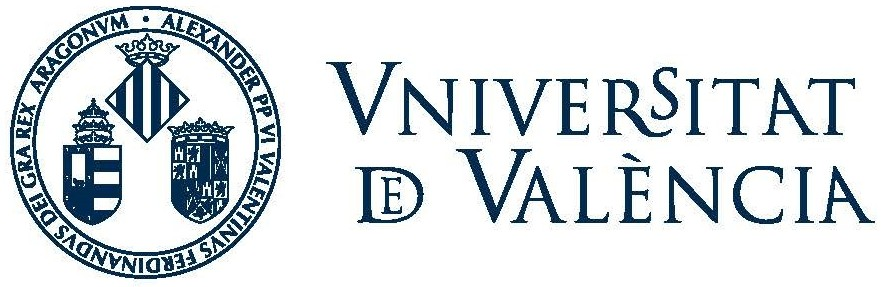

# Quantum Machine Learning (QML)

Explicaciones de algunos algoritmos famosos de QML (Quantum Machine Learning) 

```{tableofcontents}
```

%```{toctree}
%:caption: Table of Contents
%:name: mastertoc
%:glob:
%*
%```

---
Autores:

Carmen Calvo ([SCAYLE](https://www.scayle.es/)), Antoni Alou ([PIC](https://www.pic.es/)), Carlos Hernani ([UV](https://www.uv.es/)), Nahia Iriarte ([NASERTIC](https://www.nasertic.es/es)) y Carlos Luque ([IAC](https://www.iac.es/))





---
<figure><center>

</center></figure>

<center>
<a rel="license" href="http://creativecommons.org/licenses/by-sa/4.0/">
</a>
</center>

License: <a rel="license" href="http://creativecommons.org/licenses/by-sa/4.0/">Licencia Creative Commons Atribución-CompartirIgual 4.0 Internacional</a>.

This work has been financially supported by the Ministry for Digital Transformation and of Civil Service of the Spanish Government through the QUANTUM ENIA project call - Quantum Spain project, and by the European Union through the Recovery, Transformation and Resilience Plan - NextGenerationEU within the framework of the Digital Spain 2026 Agenda.

<center>

</center>
